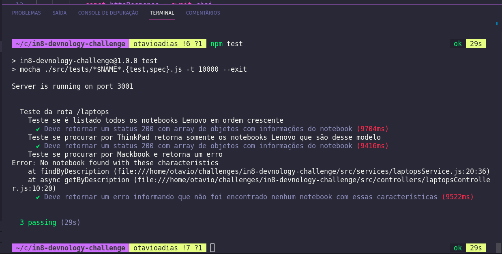

# Boas Vindas ao repositório do IN8 - Devnology | TECH CHALLENGE!

Aplicação Back-End que faz WebScrapping utilizando Node.js + Puppeteer;

# Desafio

Acessar este site e pegar todos os notebooks Lenovo ordenando do mais barato para o mais caro. 
Pegar todos os dados disponíveis de cada produto.

https://webscraper.io/test-sites/e-commerce/allinone/computers/laptops

É interessante que o robô possa ser consumido por outros serviços. 
Recomendamos a criação de uma pequena REST Ful API JSON para deixar mais otimizado.

# Orientações para executar o projeto

## Como inicializar o projeto na sua máquina
<summary><strong>Baixando o projeto do Github</strong></summary><br />

  1. Clone o repositório utilizando do `SSH`
   * `git clone git@github.com:otavioadias/in8-devnology-challenge.git`

  - Acesse a pasta do repositório clonado:
    * `cd in8-devnology-challenge`

  2. Instale as dependências:
   * `npm install`image.png

  3. Inicialize a aplicação e aguarde a mensagem de 'Online' no terminal:
   * `npm start`

# Sobre o Projeto

## Extração de dados e organização

 1. Foi realizado WebScrapping utilizando Node.js + Puppeteer e ao inicializar a aplicação é gerado um arquivo Clone o repositório utilizando do `lenovoLaptops.json` no seguinte formato:
 ```json 
 [
  {
    "title": "Lenovo V110-15IAP",
    "price": 321.94,
    "description": "Lenovo V110-15IAP, 15.6\" HD, Celeron N3350 1.1GHz, 4GB, 128GB SSD, Windows 10 Home",
    "memory": "HDD:",
    "swatches": "128 256 512 1024",
    "ratings": "5 reviews   ",
    "stars": 3
  },
  {
    "title": "Lenovo V110-15IAP",
    "price": 356.49,
    "description": "Asus VivoBook 15 X540NA-GQ008T Chocolate Black, 15.6\" HD, Pentium N4200, 4GB, 500GB, Windows 10 Home, En kbd",
    "memory": "HDD:",
    "swatches": "128 256 512 1024",
    "ratings": "6 reviews  ",
    "stars": 2
  },
  {
    "title": "Lenovo ThinkPad E31-80",
    "price": 404.23,
    "description": "Lenovo ThinkPad E31-80, 13.3\" HD, Celeron 3855U 1.6GHz, 4GB, 128GB SSD, Windows 10 Home",
    "memory": "HDD:",
    "swatches": "128 256 512 1024",
    "ratings": "12 reviews ",
    "stars": 1
  },
  {
    "title": "Lenovo V110-15ISK",
    "price": 409.63,
    "description": "Lenovo V110-15ISK, 15.6\" HD, Core i3-6006U, 8GB, 128GB SSD, Windows 10 Home",
    "memory": "HDD:",
    "swatches": "128 256 512 1024",
    "ratings": "9 reviews   ",
    "stars": 3
  },
  {
    "title": "Lenovo V110-15ISK",
    "price": 454.73,
    "description": "Lenovo V110-15ISK, 15.6\" HD, Core i3-6006U, 4GB, 128GB SSD, Windows 10 Pro",
    "memory": "HDD:",
    "swatches": "128 256 512 1024",
    "ratings": "2 reviews  ",
    "stars": 2
  },
  {
    "title": "Lenovo V110-15IKB",
    "price": 465.95,
    "description": "Lenovo V110-15IKB, 15.6\" HD, Core i5-7200U, 4GB, 500GB, DOS",
    "memory": "HDD:",
    "swatches": "128 256 512 1024",
    "ratings": "7 reviews ",
    "stars": 1
  },
  {
    "title": "Lenovo V510 Black",
    "price": 484.23,
    "description": "Lenovo V510 Black, 14\" HD, Core i3-6006U, 4GB, 128GB SSD, Windows 10 Home",
    "memory": "HDD:",
    "swatches": "128 256 512 1024",
    "ratings": "8 reviews   ",
    "stars": 3
  },
 ...
]
```

## Endpoints

* No diretório backend existe o `thunder-collection_Laptops Lenovo.json` com todos os endpoits já prontos.
* Caso queira usar é necessário utilizar da extensão do ThunderClient.

### Acesso à todos os notebooks Lenovo em ordem crescente de valor:

 - O endpoint utilizado para a requisição GET é `/laptops` e retorna:
  ```json 
 [
  {
    "title": "Lenovo V110-15IAP",
    "price": 321.94,
    "description": "Lenovo V110-15IAP, 15.6\" HD, Celeron N3350 1.1GHz, 4GB, 128GB SSD, Windows 10 Home",
    "memory": "HDD:",
    "swatches": "128 256 512 1024",
    "ratings": "5 reviews   ",
    "stars": 3
  },
  {
    "title": "Lenovo V110-15IAP",
    "price": 356.49,
    "description": "Asus VivoBook 15 X540NA-GQ008T Chocolate Black, 15.6\" HD, Pentium N4200, 4GB, 500GB, Windows 10 Home, En kbd",
    "memory": "HDD:",
    "swatches": "128 256 512 1024",
    "ratings": "6 reviews  ",
    "stars": 2
  },
  {
    "title": "Lenovo ThinkPad E31-80",
    "price": 404.23,
    "description": "Lenovo ThinkPad E31-80, 13.3\" HD, Celeron 3855U 1.6GHz, 4GB, 128GB SSD, Windows 10 Home",
    "memory": "HDD:",
    "swatches": "128 256 512 1024",
    "ratings": "12 reviews ",
    "stars": 1
  },
  {
    "title": "Lenovo V110-15ISK",
    "price": 409.63,
    "description": "Lenovo V110-15ISK, 15.6\" HD, Core i3-6006U, 8GB, 128GB SSD, Windows 10 Home",
    "memory": "HDD:",
    "swatches": "128 256 512 1024",
    "ratings": "9 reviews   ",
    "stars": 3
  },
  {
    "title": "Lenovo V110-15ISK",
    "price": 454.73,
    "description": "Lenovo V110-15ISK, 15.6\" HD, Core i3-6006U, 4GB, 128GB SSD, Windows 10 Pro",
    "memory": "HDD:",
    "swatches": "128 256 512 1024",
    "ratings": "2 reviews  ",
    "stars": 2
  },
  {
    "title": "Lenovo V110-15IKB",
    "price": 465.95,
    "description": "Lenovo V110-15IKB, 15.6\" HD, Core i5-7200U, 4GB, 500GB, DOS",
    "memory": "HDD:",
    "swatches": "128 256 512 1024",
    "ratings": "7 reviews ",
    "stars": 1
  },
  {
    "title": "Lenovo V510 Black",
    "price": 484.23,
    "description": "Lenovo V510 Black, 14\" HD, Core i3-6006U, 4GB, 128GB SSD, Windows 10 Home",
    "memory": "HDD:",
    "swatches": "128 256 512 1024",
    "ratings": "8 reviews   ",
    "stars": 3
  },
 ...
]
```

- Endpoint extra: O endpoint para buscar unm produto específico pela descrição tem uma requisição GET e seu endpoint é `/laptops/search?q=` e retorna a busca que você quiser, por exemplo se o endpoint for `/laptops/search?q=ThinkPad T470` o retorno é:
```json
[
    {
        "title": "Lenovo ThinkPad T470",
        "price": 1349.23,
        "description": "Lenovo ThinkPad T470, 14\" FHD IPS, Core i5-7200U, 8GB, 256GB SSD, Windows 10 Pro",
        "memory": "HDD:",
        "swatches": "128 256 512 1024",
        "ratings": "5 reviews ",
        "stars": 1
    }
]
```

# Testes

Para rodar testes no seu back-end, utilize o comando com o servidor parado:
  - `npm test`

 